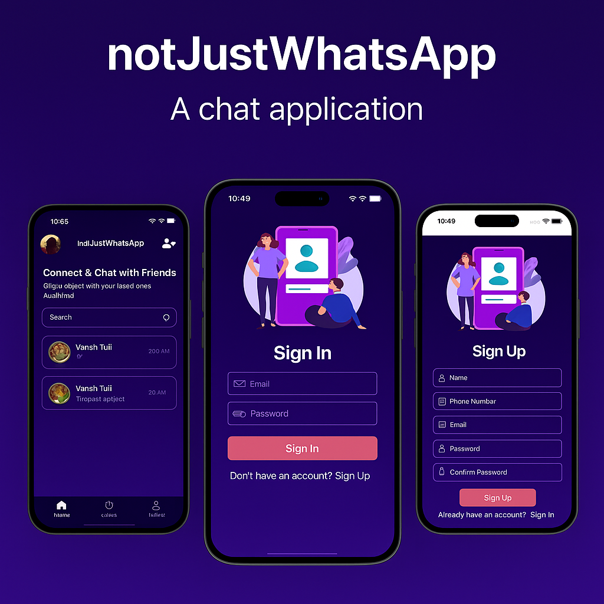
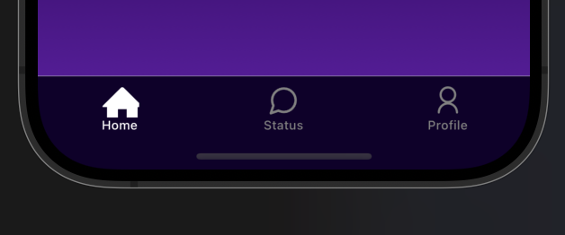
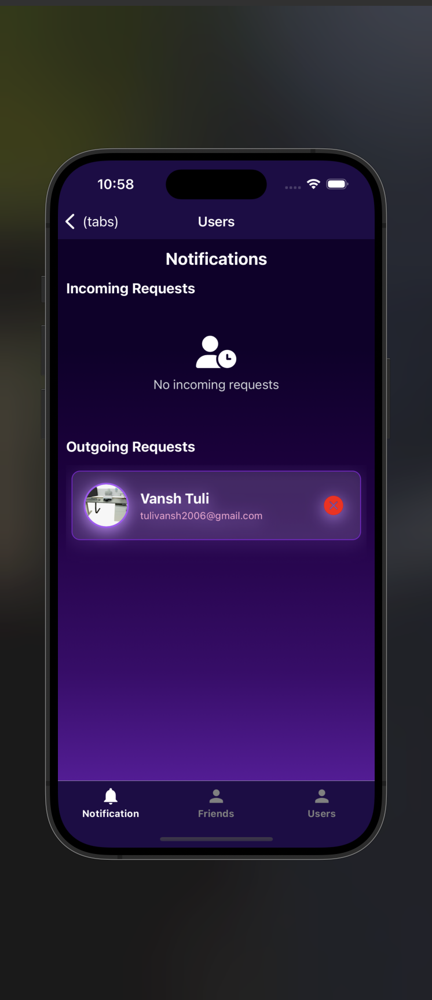

# 📱 notJustWhatsapp

A modern, full-featured chat application built with **React Native + Expo**, integrating **Stream Chat** for real-time messaging and **Supabase** for user authentication, profile management, and cloud storage.

> Inspired by WhatsApp, improved by creativity. 💬✨

<p align="center">
  
</p>

---

## 🚀 Features

### 🔐 Authentication & User Profiles
- **Email/Password Sign Up & Login** using Supabase Auth.
- **Session Management** using a global AuthProvider.
- **User Profile Storage** in Supabase Database (`profiles` table).
- **Avatar Upload** with Expo Image Picker + Supabase Storage.
- **Profile Update Page** with live preview and validation.

### 👥 Friend System
- **Send Friend Requests** to other users.
- **Accept/Reject Requests** from a notification-style interface.
- **Friends List Management** (only friends can chat).
- Backend logic stored in Supabase `friendships` table.

### 💬 Real-time Messaging
- Powered by **Stream Chat SDK**.
- **1-on-1 Chat** between friends.
- **User Online Status**, message seen ticks, typing indicators.
- **Custom UI for Chat Bubbles**, timestamps, and reactions.
- **Profile Pictures** appear in chats and user lists.

### 📝 Insta-like Notes (Status Updates)
- Post short text-only updates visible to friends for 24 hours.
- View friends' notes in a dedicated tab.
- Note backend powered by Supabase with TTL-like logic.

### 🔔 Notifications
- Tab for managing:
  - Friend requests
  - Chat invitations
  - Rejected/pending request statuses

---

## 🧱 Tech Stack

| Tech              | Role                          |
|-------------------|-------------------------------|
| React Native      | UI development (with Expo)    |
| Supabase          | Auth, DB, Storage             |
| Stream Chat       | Real-time messaging           |
| Expo Image Picker | Profile avatar selection      |

---

## 📸 Screenshots

### 🔐 Authentication

<p float="left">
  
  
</p>

---

### 🏠 Home & Users

<p float="left">
  
  
  
  
</p>

---

### 👥 Friends & 🔔 Notifications

<p float="left">
  
  
</p>

---

## 🛠️ Installation & Setup

### 📦 Prerequisites

- Node.js
- Expo CLI
- Supabase Project (set up `profiles`, `friendships`, `notes`)
- Stream Chat API Key

---

### ⚙️ Clone the Repo

```bash
git clone https://github.com/your-username/notJustWhatsapp.git
cd notJustWhatsapp

